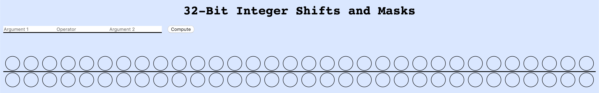
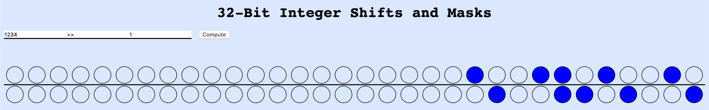
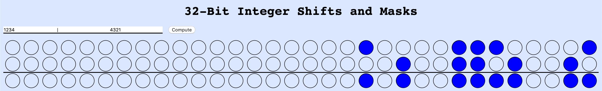

# 32-Bit Integer Shifts and Masks Visualization
Visualization of how bit shifting and bit masks work in relation to 2 arguments and an operator.

### How to Use
Download the 1\_Bit\_Operations folder and open index.html in a browser.
Enter any integer followed by a bitwise operator and a second integer. When compute is clicked, the result will be displayed in bits under the line.

Valid bitwise operators are:

- **Shift Right:** `>>`
- **Shift Left:**  `<<`
- **Bitwise Or:**  `|`
- **Bitwise And:** `&`
- **Bitwise Xor:** `^`

When '|', '&', or '^' is selected, the second integer will be displayed.

### Built With
* JavaScript
* React
* HTML