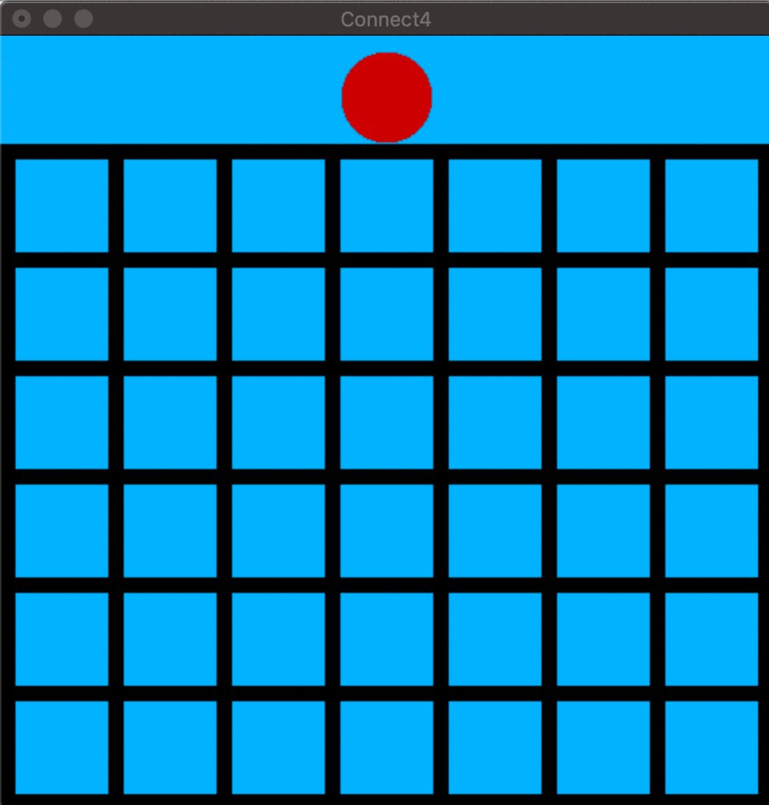
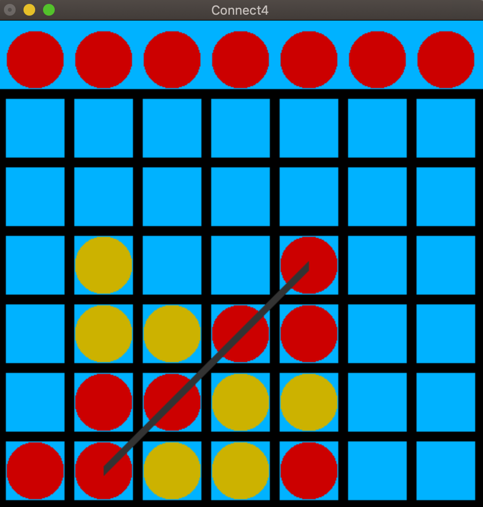

# OpenGL Connect-4
Implementation of Connect 4 using C and OpenGL. Supports one and two players.
### How to Use
Download the connect4.c and connect4.h files. On Mac OS X, compile and run with `gcc connect4.c -framework GLUT -framework OpenGL && ./a.out`
The color of the top piece corresponds to the current player's turn.

When a player has 4 pieces in a row, the player color will be displayed above the board, and a line will connect the winning pieces.

### Controls:
- **Left and Right Arrow Keys:** Move the piece at the top
- **Space Bar:** Place the top piece during a game, reset at the end of a game
- **'b' or 'B':** Have the computer place a piece
- **'q' or 'Q':** Quit the game

### Built With:
- C
- OpenGL
