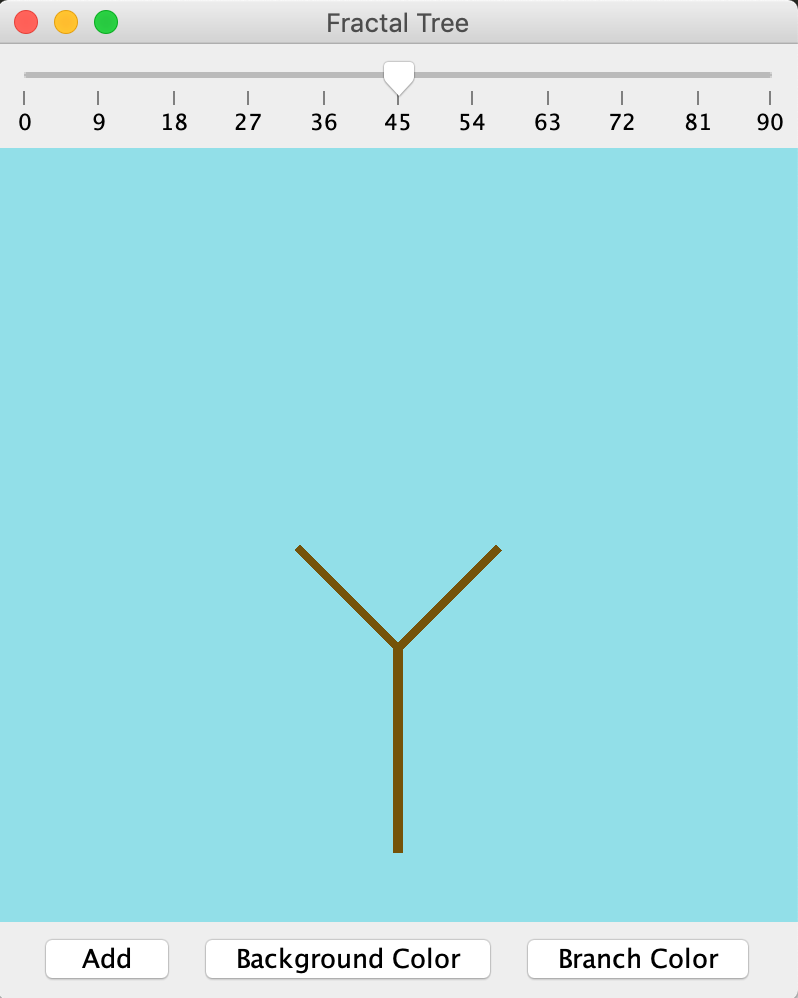
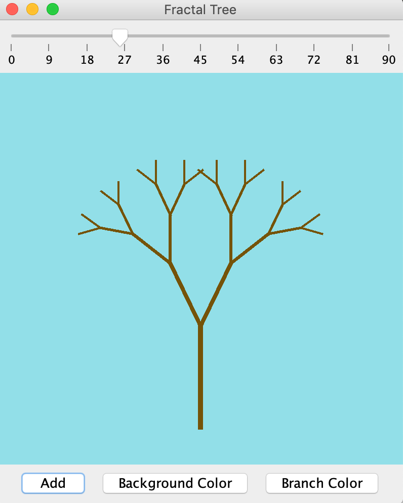
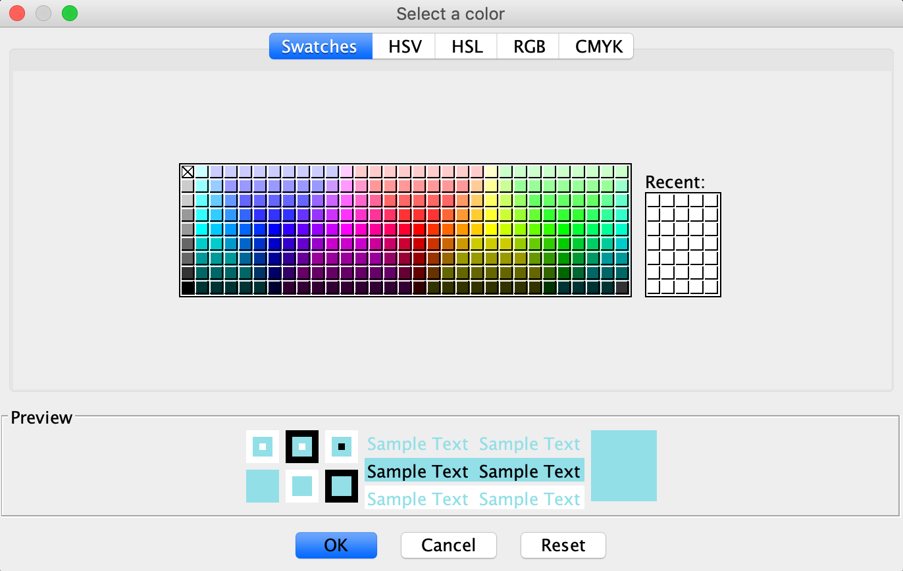
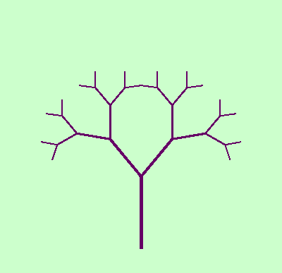
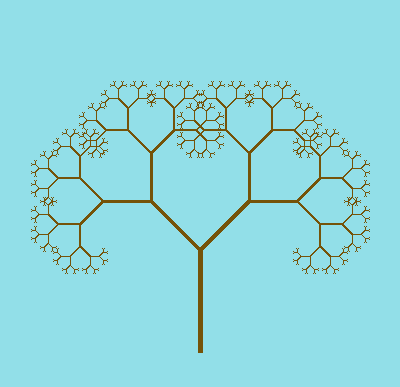

# Fractal Tree Generator
Fractal tree generator graphical user interface implemented in Java.

### How to Use:
Download the 3\_Fractal\_Tree folder. Compile and run with `javac DrawingPanel.java && java DrawingPanel`

The tree starts with 2 branches, every time `Add` is pressed, another set of branches will be added.

The top slider changes the angle of each branch.

The `Background Color` and `Branch Color` buttons open a Color Picker to edit the  color of respective parts.

Press `'s'` to screenshot the current tree as "tree.png"

### Built With:
- Java 8
