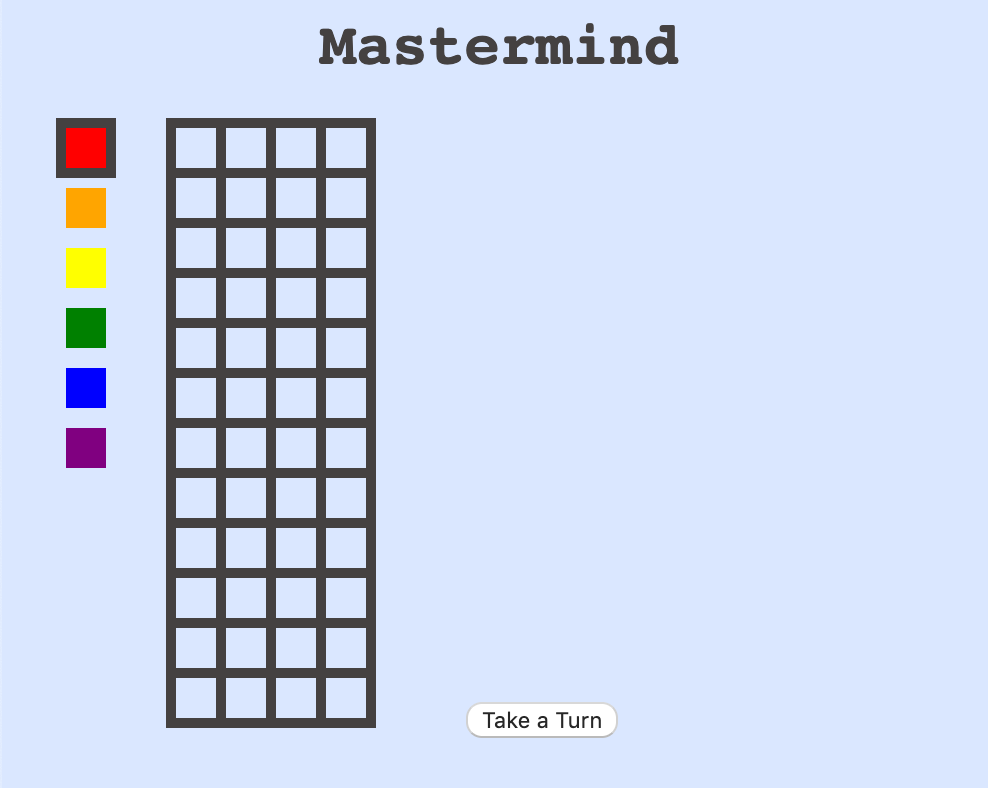
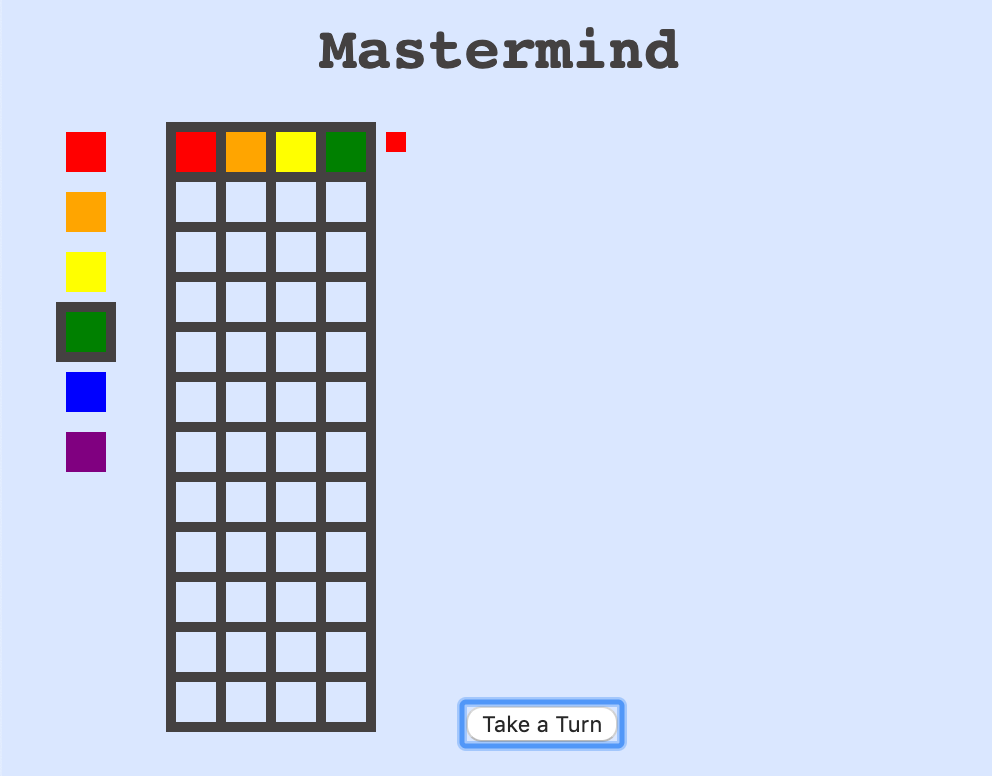
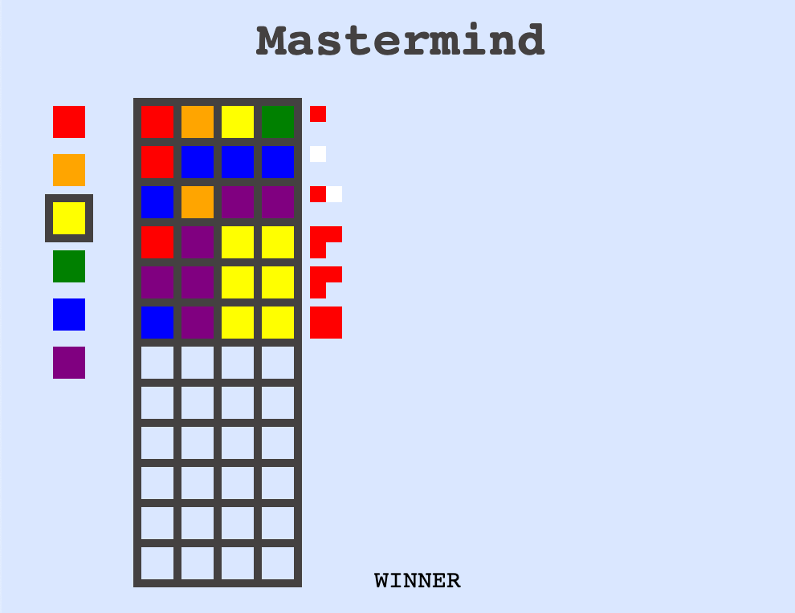

# Mastermind
Mastermind game implemented in React using svg rectangles.


### How to Use:
Download the 5\_Mastermind folder and open index.html in a browser. Select colors on the side, and click on the grid to place a piece. Press take a turn when you are ready to guess.


Each small red square means 1 piece is in the right spot, each small white square means 1 piece is the right color but wrong spot.


### Shortcuts:
```
[1-6] keys - select a color
Enter key - place the selected color in the first available spot
Space bar - take a turn
'c' key - clear your current guess
'r' key - reset the board and generate a new sequence
```

### Built With:
* JavaScript
* React
* HTML