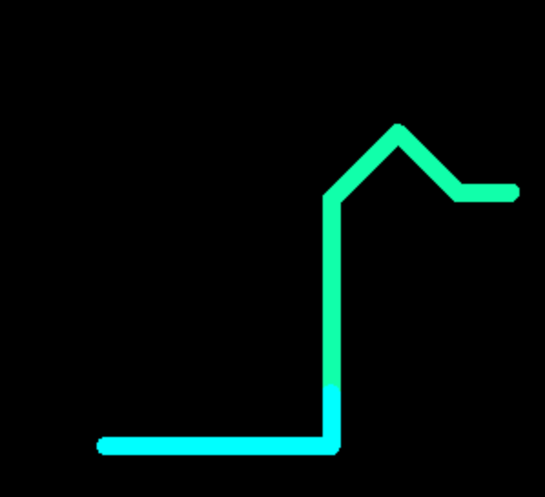

# OpenGL Turtle
A painter turtle using C and OpenGl with terminal command control.


### How to Use
Download the turtle.c and turtle.h files. On Mac OS X, compile and run with `gcc turtle.c -framework GLUT -framework OpenGL -lreadline && ./a.out`

Press space to enter in new commands for the turtle, or press 'q' to quit.


### Controls:

- `MOV` - start the turtle motion
- `ROT` - rotate the turtle's path
- `LEN` - change the brush size
- `RGB` - change the paint color
- `END` - end the program

Example:

```
> MOV
> RGB
Enter color in hex: 11ffaa
> LEN
Enter size: 10
> ROT
Enter degrees: 45
> END
```

### Built With:
- C
- OpenGL
